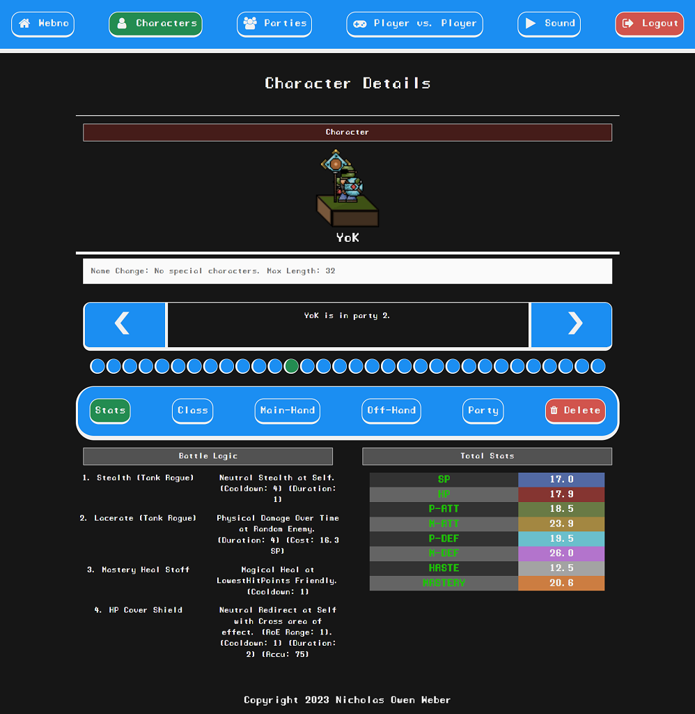
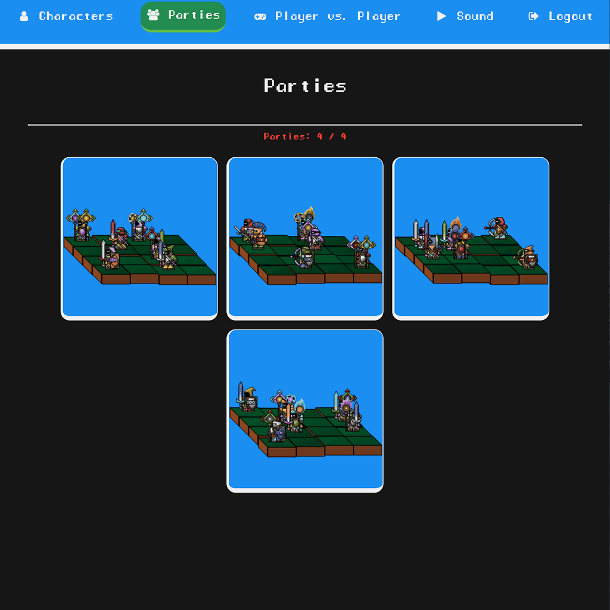
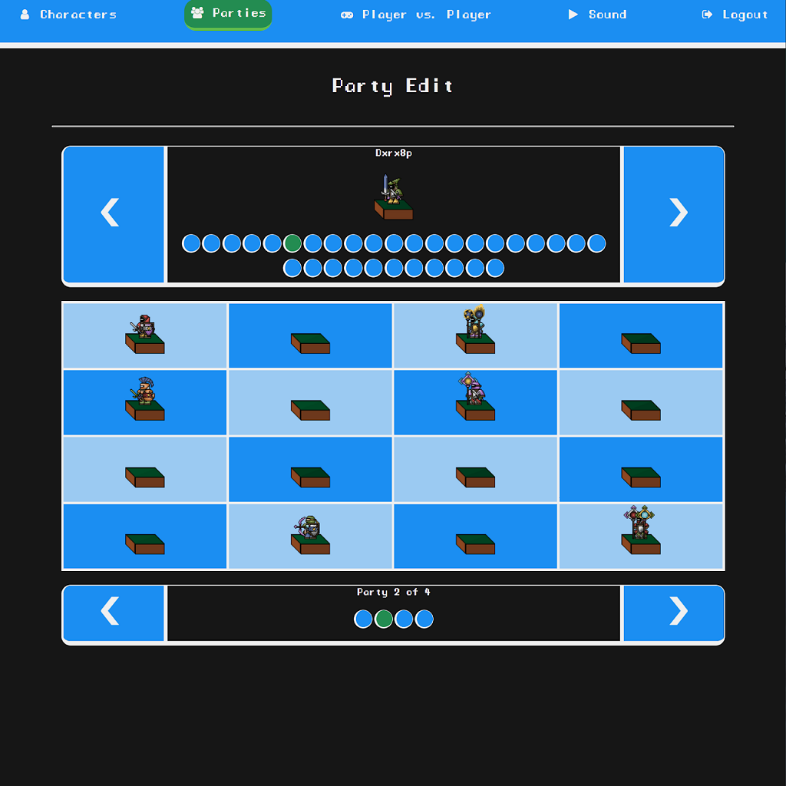
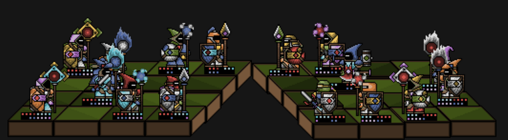
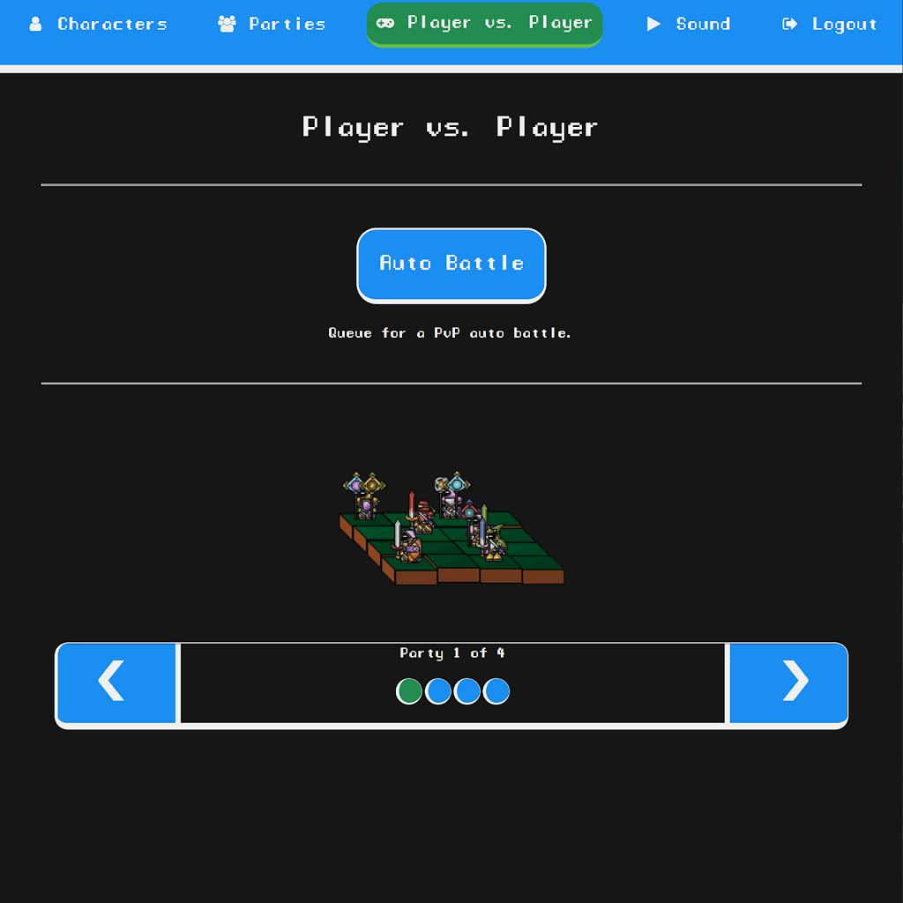
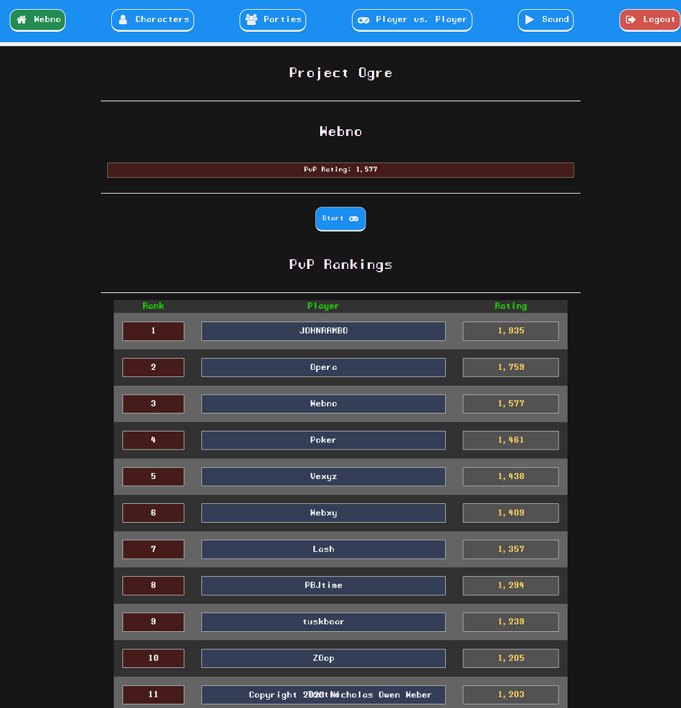

# Noweber's Project Portfolio

Welcome to my personal project portfolio! Here, you'll find a showcase of my projects, complete with descriptions, screenshots, links to the working versions, and the technology stacks used.

---

## [Project Ogre](https://github.com/noweber/Project-Ogre)

_Description:_ A player vs. player auto-battle strategy RPG.

### Feature Screenshots:
#### Customize Characters

#### Buiild Synergetic Parties

#### Watch Engaging Auto-Battles

#### Conquer PvP

### Playable URL
This is a commercial product under development. You will need a personalized acces code to play. Please email me directly for this until the open beta.
[Play](https://project-ogre-ui.azurewebsites.net/title)

### Technology Stack
- List of technologies and frameworks used in this project.
- Angular 16
- .NET 7
- Azure Services:
  - Azure BLOB Storage
  - Azure SQL
  - Azure Cosmos DB
  - Azure Event Hubs
  - Azure Databricks
  - Azure OpenAI
  - Azure Kubernetes Service
  - Azure Functions
---

## Project 2: [ProjectName2](https://github.com/YourUsername/ProjectName2)

_Description:_ A brief description of the project and its purpose.

### Screenshots
| Landing Page | User Dashboard |
|--------------|----------------|
|  |  |

### [View Project](https://project-ogre-ui.azurewebsites.net/title) | [GitHub Repository](https://github.com/YourUsername/ProjectName2)

### Technology Stack
- List of technologies and frameworks used in this project.

---

## Project 3: [ProjectName3](https://github.com/YourUsername/ProjectName3)

_Description:_ A brief description of the project and its purpose.

### Screenshots
| Prototype | Admin Panel |
|-----------|-------------|
|  |  |

### [View Project](https://your-website.com/project3) | [GitHub Repository](https://github.com/YourUsername/ProjectName3)

### Technology Stack
- List of technologies and frameworks used in this project.

---

## Contact

You can reach out to me via email at [your.email@example.com](mailto:your.email@example.com). Let's connect!

